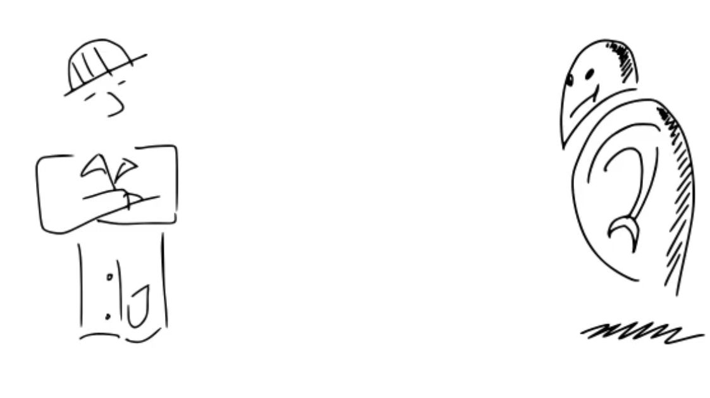
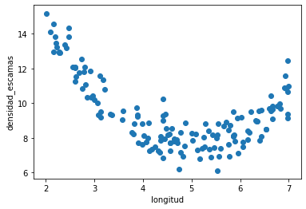

    show on top "Designing machine learning algorithms"
    show scientist

[0:0] Vamos a ponernos el sobrero de la persona que quiere diseñar un nuevo algoritmo de machine learning. Y vamos a ver el proceso por el cual se plantea esto, desde que tenemos una intuición hasta que finalmente armamos un procedimiento de entrenamiento de un modelo basado en datos.

[0:24] Cómo vamos a ver, las máquinas NO aprenden, sino que se calibran con algoritmos.

    show in big "MACHINES DO NOT LEARN"

[0:31] Y esta distinción es muy importante, porque denota que estamos ante un proceso gobernado por la computación, las matemáticas, la estadística, ..., es decir, por los ingenieros y los científicos que trabajamos en esto, y no por ejércitos de máquinas que van a conquistar el mundo.

    show comic below make robot vanish
  

[0:53] Prácticamente todos los algoritmos de machine learning son diseñados el procedimiento general que vamos a ver en este video. Y esto incluye la regresión lineal, los árboles de decisión, las máquinas de soporte vectorial, las redes neuronales,  "Random Forests", "Nearest Neighbors", en fin ...

    delete robot, show in random positions "linear regression", 
    decision trees, support vector machines, neural networks, etc. 

[1:18] Por supuesto, dentro de este proceso, cada algoritmo tiene tienes sus retos y particularidades, pero el esquema general el proceso es el mismo.

    clear and show following figure

  

[1:37] Veamos entonces cómo es esto.

Partimos de una tarea que se plantea. Tomemos como ejemplo una tarea de regresión muy sencilla. 

[1:50] Dada una entrada (la longitud de unos bichitos), a la que llamamos $x^{i}$, queremos predecir otra variable: su densidad de escamas, que llamamos $y^{i}$. 

    show equation below
    
$x^{i}$= length, $y^{i}$ = density

[2:07] y el superíndice $i$ para denotar a cada bichito. Tenemos $N$ bichitos, y por tanto $N$ pares de $x$ e $y$, uno para cada bichito al que le medimos la longitud y la densidad de escamas.

    show equation below
    
$(x^{0}, y^{0})$, with $i$ in (0,...,N-1), when we have N bugs

[2:30] la idea es que la densidad de escamas es muy costosa de medir (hay que contarlas) y por eso queremos un modelo predictivo. 

[2:43] Hemos hecho una campaña de adquisición de datos etiquetados, y estamos planteando una tarea de aprendizaje supervisado.

    show "supervised machine learning"

[2:58] Lo primero que tenemos que hacer es definir cual es la suposición inicial, y la estructura de nuestro modelo.

    show at left "1. Define model structure"

[3:10] en este caso, vamos a asumir que la relación entre la entrada y la salida es lineal, que es el caso más sencillo. En realidad, en nuestros datos vemos que la estructura **NO ES LINEAL**, si no cuadrática,

    show quadratic fit.

[3:27] con lo cual estamos partiendo de un supuesto que **NO SE AJUSTA A ESTOS DATOS** pero eso lo vemos porque tenemos un ejemplo de juguete con sólo una variable y podemos visualizarlos. En la inmensa mayoría de los casos, esto ni lo sabemos ni lo podemos ver.

[3:50] De hecho, elegir un modelo (o algoritmo) que parta de un supuesto que se ajuste a los datos que tengo en un cierto momento, es en sí uno de los retos principales al abordar el desarrollo de cualqueir modelo predictivo con machine learning. Si te suenan las nociones de overfitting y underfitting, son las que en la práctica, nos dan pistas sobre qué modelos pueden ser mejores o peores para un problema concreto.

    show words 'overfitting' 'underfitting'

[4:30] En el notebook a continuación vamos a implementar estas ideas y reparar esto, pero por ahora, sigamos con esta suposición y veamos donde nos lleva.

[4:41] Segundo paso, tenemos que definir la **parametrización** de modelo. Es decir, cuantos parámetros necesitamos para describir una solución 

    show  at left "2. Define model parametrization" below 1

[4:51] En este caso, cualquier solución viene dada por una linea recta en el plano de longitud y densidad, que es este que vemos. Y en este plano 2D, para describir cualquier línea necesitamos 2 parámetros, que llamamos $\theta_0$ y $\theta_1$.

    show text theta1: slope, theta0: intercept

[5:13] Distintos valores de los parámetros nos dan distintas rectas. Todas estas son posibles soluciones, cada una descrita por dos parámetros.

    show random lines on the plane, which the value of $theta_0$ y $theta_1$ for each solution

[5:30] En este caso, tenemos una interpretación muy directa de los parámetros: son el intercepto y la pendiente. En muchas ocasiones no vamos a poder interpretar los parámetros de un modelo tan directamente. Sin ir más lejos, a interpretaciòn de los parámetros en las redes neuronales es todo un tema de investigación.

[5:54] Por ejemplo, esta solución

    show line far off the data

vemos intuitivamente que no se ajusta muy bien a los datos.

[6:00] mientras que esta

    show line better fit

se ajusta mejor.

[6:06] En este punto, el objeto de machine learning es encontrar el modelo, DENTROS DE LA CLASE DE MODELOS QUE HEMOS SELECCIONADO (que son las rectas en este caso), que mejor se ajuste a los datos. 

[6:25] O dicho de otro modo, cuales son los parámetros que describen la recta que mejor se ajusta a los datos.

    show best line fit, with params.

[6:38] para esto necestaremos dos cosas.

una, es definir operativamente cómo se obtiene una predicción, dada una entrada $x^{(i)}$ (una longitud) y unos valores para los parámetros 

    show left "3. Define how to predict" below 2

    show several times, dash line on random x up to regression line, left to y_hat

[7:00] en este caso, es la misma ecuación de una recta que nos da la predicción.

    show next equation

$\hat{y}^{(i)} = \theta_0 + \theta_1 x^{(i)}$

[7:12] fíjate que usamos $y^{(i)}$ para denotar el valor real, y $\hat{y}^{(i)}$ con el sobrerito para denotar el valor predicho por el modelo.

[7:44] y lo otro que necesitamos, es definir cómo medir el error entre la predicción $\hat{y}^{(i)}$ y el valor real $y^{(i)}$. Esta es la función de coste, o pérdida (loss, en inglés)

    show left "4. Define cost (or loss) function" below 2

[7:58] Hay muchas maneras de medir los errores, y el error cuadrático es una de ellas

    show next equation

$error^{(i)} = (\hat{y}^{(i)} - y^{(i)})^2$

[8:17] y como tenemos $N$ bichitos, promediamos el error en la predicción de cada bichito

$\text{loss}(\theta_0, \theta_1) = \frac{1}{N}\sum_{i=0}^{N-1} (\hat{y}^{(i)} - y^{(i)})^2$

[8:31] Fíjate en dos detalles aquí:

1) elevamos al cuadrado para evitar que errores positivos se compenses con errores negativos en la suma

[8:45] 2) la pérdida es función de los parámetros del modelo. Es decir, ASUMIMOS que los datos están fijos.

    show enlarge theta0 y theta1

[8:57] Esto es CONSECUENCIA de lo que estamos buscando, recuerda que queremos los parámetros que describan la recta (o nuestro modelo) que produzca menos error. 

[9:10] Para ello vamos a ir moviendo los valores de los parámetros hasta encontrar algunos que nos satisfagan.

[9:24] Es decir, durante el proceso por el cual vamos a buscar dichos valores para los parámetros, no vamos a modificar los datos

[9:40] ahora estamos en disposición de expresar de manera más rigurosa lo que estamos buscando

$\text{arg min}_{\theta_0 \theta_1} \text{loss}(\theta_0, \theta_1)$

[9:55] es decir, hemos formulado nuestra búsqueda de un modelo que haga una cierta predicción como un problema de optimización.

    show 5. Optimize below 4

[10:08] Con lo que machine Learning es fundamentalmente un ejercicio de optimización matemática sobre un conjunto de datos. Entrenar un modelo, es en realidad OPTIMIZAR los parámetros de un modelo respecto a una función de pérdida usando unos datos concretos.

[10:32] Dos detalles que son muy importantes.

Primero, optimizar es complejo, y existe un área muy extensa de las matemáticas dedicada a ello. La gran mayoría de los métodos que usaremos para optimizar nos requieren hallar las derivadas de los parámetros respecto a la pérdida. Es decir, el gradiente

    show equation below

$\nabla = [\frac{\partial \text{loss}}{\theta_0}$, $\frac{\partial \text{loss}}{\theta_1}]$.

[10:55] Es decir, necesitamos conocer cómo varía la función de pérdida cuando variamos los parámetros, para poder encontrar los que hacen que la pérdida sea menor.

[11:14] En nuestro ejemplo, obtener el gradiente no es excesivamente complejo, aunque quizá sea algo tedioso. Si te atreves, trata de derivarla tú mismo a mano y la compruebas con esta.

[11:30] pero por supuesto con otros modelos y con más parámetros y descriptores de los datos (aquí solo tenemos uno, la longitud) esto se vuelve en un reto importante.

[11:41] por tanto, un paso necesario en este proceso es la obtención del gradiente, o sea las derivadas parciales de la pérdida respecto a los parámetros

    show 4. computing the gradient expressions, between 4 and 5, transform 5 into 6.

[11:57] fíjate que la complejidad de obtener el gradiente depende de:

    show each point below

[12:03] - la complejidad de la función de predicción
[12:11]- la complejidad de la función de pérdida
[12:16] - el número de descriptores de nuestros datos
[12:20] - el número de parámetros de nuestros modelos.

para poner esto en perspectiva, date cuenta de que

    show each point below

[12:32]- una imagen de 200x200 pixeles y 3 canales de color (RGB), tiene 200x200x3 descriptores
[12:47] - AlexNet, que fue una de las primeras redes convolucionales hace ya 10 años, tiene 61M de parámetros.

[13:15] Pero por otro lado, algo positivo, fíjate que las estructuras que estamos manejando son muy regulares.

nuestros datos de entrada $x$ suelen estar representados por alguna estructura matricial. puede ser tabular (m descriptores x n datos). 

[13:40] Aquí cada xi (x0, x1, etc.) tiene $m$ descriptores, por tanto, tenemos una matrix de m columnas y n filas, por ejemplo n pacientes, con m datos clìnicos cada paciente

    show X matrix ... n rows, m columns

[13:53] o de más dimensiones, por ejemplo si tenemos imágenes. Por ejemplo, un conjunto de imàgenes RGB tiene 4 dimensiones (nùmero de imàgenes, alto, ancho, y número de canales)
   
    show stacked images

y en la mayoría de los casos las funciones de predicción y de pérdida se pueden expresar de manera matricial.

[14:18] Por ejemplo, esta es la expresión del gradiente de la regresión linea, asumiendo m descriptores 

    show equation below

$\nabla \theta = X(X-1....)$

[14:35] donde $\theta$ es el vector con todos los parámetros. Tendremos $m$ parámetros. $X$ es la matrix con todos los datos, será de m columnas for n filas

    show eqs below

- $X \in \mathbb{R}^{n \times m}$
- $y \in \mathbb{R}^{n}$
- $\theta \in \mathbb{R}^{m}$
- $\nabla \theta \in \mathbb{R}^{n}$

con lo que en realidad estamos definiendo gradientes sobre estructuras matriciales de más o menos complejidad.

[15:07] En la actualidad, existen paquetes y librerías de programación que nos permiten cálculo simbólico (es decir, obtener derivadas, integrales, etc.) y que también nos permiten optimizar. 

[15:20] Por ejemplo en Python tenemos sympy y scipy.otimize

    show verbatim sympy and scipy.optimize

con los que de hecho vamos jugar en los notebooks siguientes.

[15:35] Pero en general estos paquetes fallan cuando los usamos con problemas y algoritmos de machine learning. Ya que, por naturaleza, acabamos construyendo expresiones con muchas matrices y muchos parámetros. Y estos paquetes son genéricos, también resuelven sistemas de ecuaciones, ecuaciones diferenciales, en fin ... Y cuando los usamos para resolver problemas de machine learning pues nos encontramos con infinidad de problemas (de memoria, de tiempo de cómputo, etc.)

[16:25] Por eso se desarrollaron paquetes como TF y Torch (y otros), que en realidad son librerías de cómputo simbólico (hacen auto-diferenciación, pero no el reto de operaciones simbòlicas como la integración, resolución de ecuanciones y demás) y de optimización, especialmente diseñadas para tratar con las expresiones y estructuras que surgen en los problemas de machine learning. Es decir, con gradientes y matrices de gran tamaño.

     show logos TF torch

[17:47] En resumen, estamos planteando problemas de optimización matemática con datos y expresiones de un cierto tipo.

        show scientist

[17:57] Nuestra capacidad de resolverlas dependerá de varias cosas:

    show next bullet points

[18:02] de diseñar o elegir la estructura de modelo correcta (una red neural con tantas capas, un árbol de decisión con tal configuración, etc.)

[18:12] de elegir bien la función de pérdida que queremos optimizar.

[18:15] de elegir bien con qué datos vamos a optimizar.

[18:20] de poder obtener los gradientes de manera eficiente y correcta.

[18:24] de usar algoritmos de optimización adecuados.

[18:28] de usar los frameworks computacionales de los que disponemos adecuadamente.

[18:50] En fin, de procesos de ciencia e ingeniería que funcionarán mejor o peor en tanto en cuanto los entendamos y sepamos manejarlos en el contexto de aplicación que tengamos.

[19:03] Y te recuerdo el proceso:

    show bullet points of process

[19:17] Es decir, las máquinas no aprenden,somos NOSOTROS los que las usamos para calibrar algoritmos con datos, mediante un proceso computacional de optimización matemática.

    show smile
