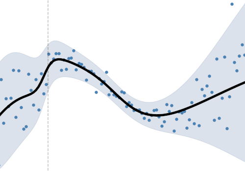

# Introduction

    

        

        

            
        

        

            
<b>1.1 What and why probabilisitc programming</b>

        

        

            What is probabilistic programming? Why is it so powerful? What does it have
            to do with Deep Learning?
        

        

            <a href="M1.1.html"><button class="btn btn-primary">Go</button></a>
        

        

    

    

        

        

            
        

        

            
<b>1.2 Course mechanics</b>

        

        

            how to access the videos, run the notebooks, submit your coding solutions
        

        

            <a href="M1.2.html">
            <button class="btn btn-primary">Go</button>
            </a>
        

        

    

