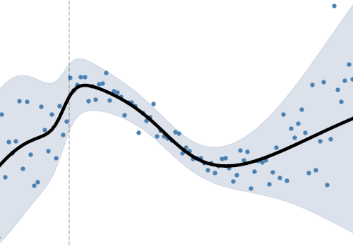
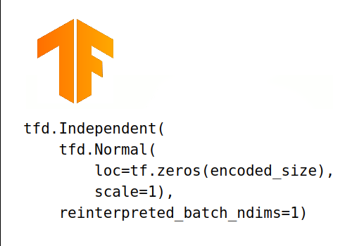

# Course outline

    

        

        

            
        

        

            
<b>1 Introduction</b>

        

        

            What is <b>probabilistic programming</b>? How to access the videos, run the notebooks, submit your coding solutions
             
            <a href="M1-videolist.html"><button class="btn btn-primary">Go to module</button></a>
        

        

    

    

        

        

            
        

        

            
<b>3 Machine learning with Tensorflow</b>

        

        

            Tensorflow, as a matrix based symbolic computing engine for machine learning.
             
            <a href="M2-videolist.html"><button class="btn btn-primary">Go to module</button></a>
        

        

    

    

        

        

            
        

        

            
<b>3 Intuitions on probability</b>

        

        

            Probability and distributions, marginals, conditionals, likelihood
             
            <a href="M3-videolist.html"><button class="btn btn-primary">Go to module</button></a>
        

        

    

 

    

        

        

            
        

        

            
<b>4 Tensorflow Probability</b>

        

        

            TF Probability objects, distributions, shapes, layers, etc.
             
            <a href="M4-videolist.html"><button class="btn btn-primary">Go to module</button></a>
        

        

    

    

        

        

            
        

        

            
<b>5 Bayesian modelling</b>

        

        

            Bayes theorem, uncertainty and knowledge update, priors, likelihood, evidence, posteriors.
             
            <a href="M5-videolist.html"><button class="btn btn-primary">Go to module</button></a>
        

        

    

    

        

        

            
        

        

            
<b>6 Variational inference</b>

        

        

            Optimization for Bayes modelling, VI on model parameters, VI on data.
             
            <a href="M6-videolist.html"><button class="btn btn-primary">Go to module</button></a>
        

        

    

