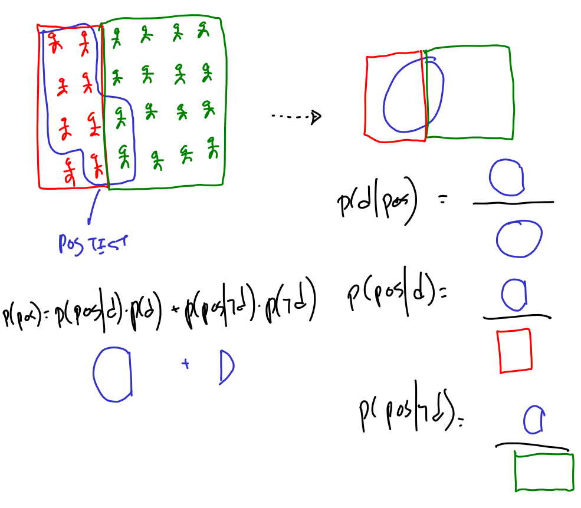

# Bayes theorem example

from https://machinelearningmastery.com/bayes-theorem-for-machine-learning/

Let's consider the following scenario: Consider a human population that may or may not have a certain disease and a medical test that returns positive or negative for detecting the disease (Test is Positive or Negative), e.g. like a mammogram for detecting breast cancer, or a PCR for detecting COVID.

We are told:

- $P(disease)$ = 30% = 0.3 $\rightarrow$ the incidence of the disease in the population $\rightarrow$ my current knowledge about whether I have the disease
- $P(pos|disease)$ = 0.85 $\rightarrow$ the sensitivity of the test: if you DO have the disease, only 85% of the times the test will confirm so. This should be given by the manufacturer of the test.

We undergo a test and turns out positive (it is an observation)

- we want to know $P(disease|pos)$ $\rightarrow$ the probability (my knowledge) about having the disease, once I have the new information about a positive test result

Let's first use Bayes theorem algebraically

$$P(disease|pos) = \frac{P(pos|disease)P(disease)}{P(pos)}$$

We almost have everything to do the calculation, we are missing $P(pos)$.

What is $P(pos)$? This is the probability of testing positive, if we would be testing the full population. We **don't know** this, but if we consider **ALL** possibilities under which we can have a positive test we **COULD** obtain it. 

In this scenario, a positive result may only happen in two circumstances: with or without the disease.

$P(pos) = P(pos|disease)*P(disease) + P(pos|\neg disease)P(\neg disease)$

and we can say that $P(\neg disease) = 1 - P(disease) = 1 - 0.02 = 0.98$

we are still missing $P(pos|\neg disease)$, which is the probability of having a positive result if I **DONT** have cancer. A **false positive**. This must be given also by the manufacturer of the test.

- We are told that $P(pos|\neg disease)=0.05$

Therefore: $P(pos) = 0.85 * 0.3 + 0.05 * 0.7 = 0.29$

And now $P(disease|pos) = 0.85 * 0.3 / 0.29 = 0.879$

We did this algebraically, let's understand this better

Let's now explore other situations, supose now that the incidence of the disease is much less, but the quality of the equipment is the same: $P(disease) = 0.01$

$P(pos) = 0.85 * 0.01 + 0.05 * 0.99 = 0.058$

And now $P(disease|pos) = 0.85 * 0.01 / 0.058 = 0.147$

why did this happen. Observe that the proportions change

observe that although the proportion of false positives remain the same, the number of false positives increases, because there is much more people without the disease.

### naming parts

likelihood, prior, posterior, normalizing factor

observe in the computation above that the numerator is one of the terms of the denominator, and this is why this is named the normalizing factor, as it ensures this is going to be a true probability $0<p<1$

### another test

let's now take a second test.

this time, our prior is not anymore $0.01$, which was the general incidence of the disease in the population, but $0.147$ which was the posterior after processing the result of the first test.

so we compute again

$P(pos) = 0.85 * 0.147 + 0.05 * (1-0.147) = 0.1676$

And now $P(disease|pos) = 0.85 * 0.147 / 0.1676 = 0.746$

### finally, which is the best way to improve the overall accuracy of the test?

recall that we have two kinds of errors:

- $P(neg|disease)$: false negative
- $P(pos|\neg disease)$: false positive

if we had to decide where to invest effort and money to improve our testing device, would we trye to reduce FPR or FNR?

let's see what is the effect of each kind of improvement.

Overall, we would like both of the following to be as high as possible

$$P(disease|pos) = \frac{P(pos|disease)P(disease)}{P(pos|disease)P(diseas) + P(pos|\neg disease)P(\neg disease)}$$

and

$$P(\neg disease|neg) = \frac{P(neg|disease)P(disease)}{P(neg|disease)P(disease) + P(neg|\neg disease)P(\neg disease)}$$

this is, that we can rely on the test both when predicting the presence or the absence of the disease

